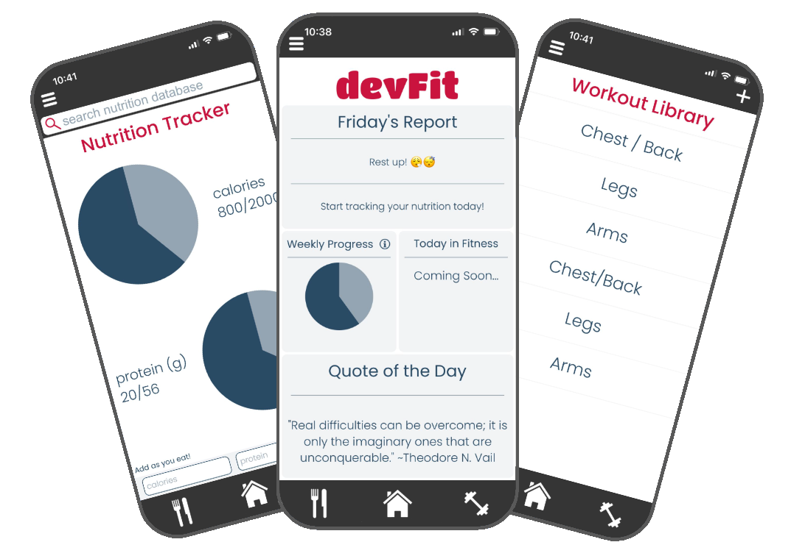

# devFit

My app to achieve my personal fitness goals. Using the React Native framework, I developed screens for tracking my daily nutritional intake and storing my workout plans. 

## Current Features
This app was custom built to support my own fitness journey. Check out some of the features I chose to implement!
### Workout Cards
- Conveniently track your workouts, including sets, reps, and weights.
- The workout library holds a record of any workout for you to refer back to.
### Nutrition Tracking
Enter caloric and protein intake to ensure your nutritional goals are met.
Use the search bar to query a database for nutritional information.

## Future Development
As my own fitness goals develop, I've found new features that I'd like to have. Please suggest any additional features/report bugs [here](https://forms.gle/HTJ1qEQARV3jftXR9)!
### Individual Workout Bank
- Rather than always accessing a full workout, query library for an individual workout.
- Allows flexibility with workouts while keeping track of an individual exercise.
### Main Screen Functionality
- Implement a weekly progress tracker as a motivational tool for users.
- Add "Today In Fitness" section, which shows popular news or videos from the fitness industry. 
